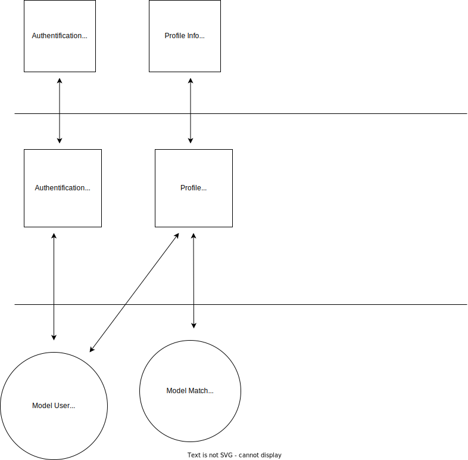

## First Meeting

Starting date : November 2nd

Here are the tasks to do regarding the first work iteration :

- Makefile
- Dockerfiles
- Docker-compose
- set up the database (Prisma)
- set up the BE + FE

@mhahn and @wollio will work on their respective branches in order to set up the fundamentals of the project.

## Second Meeting

Date : November 21th

@mhahn takes the left one and @wollio the right one.
